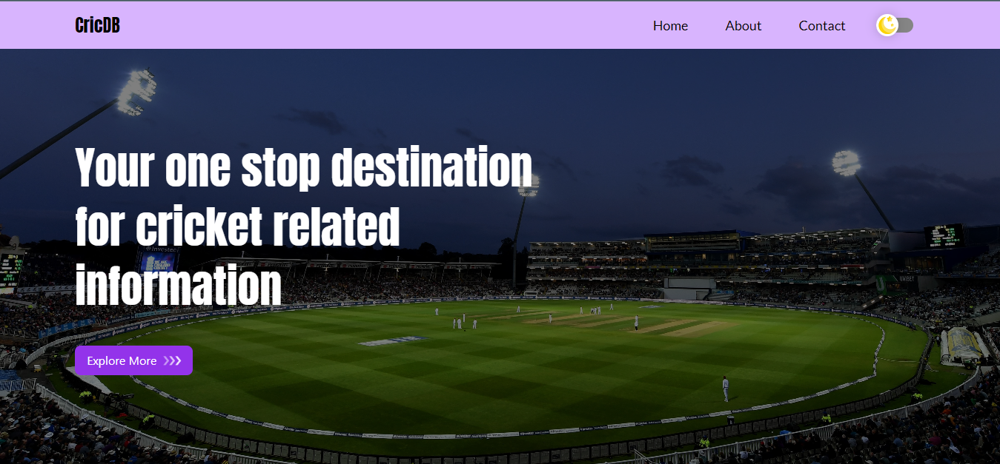
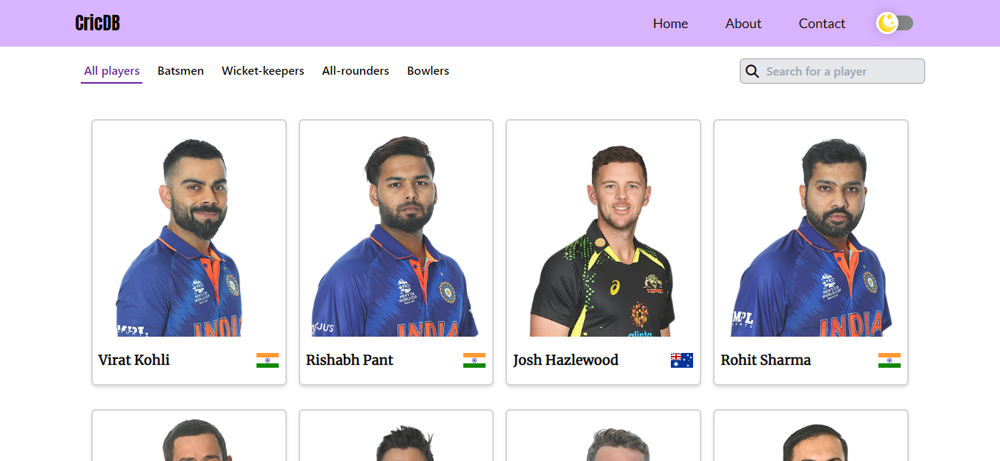
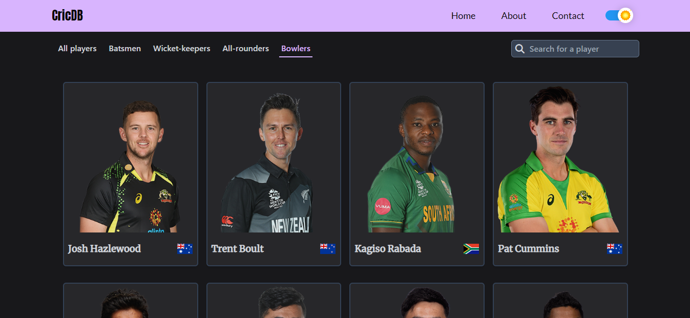
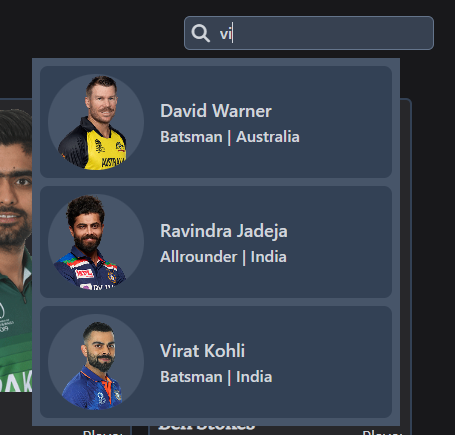
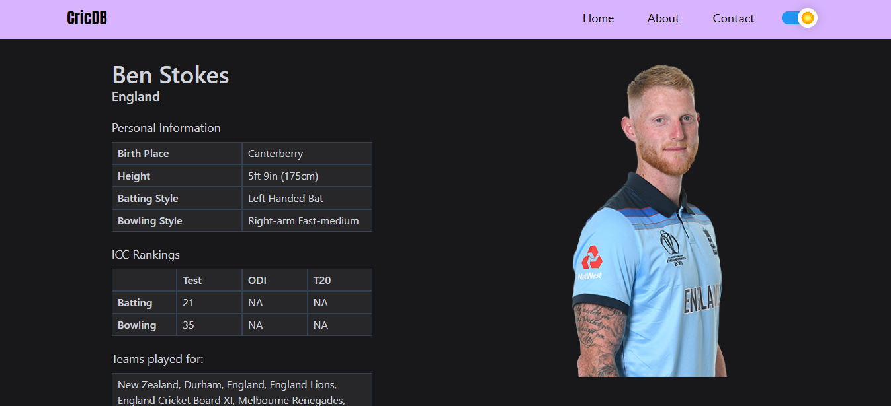
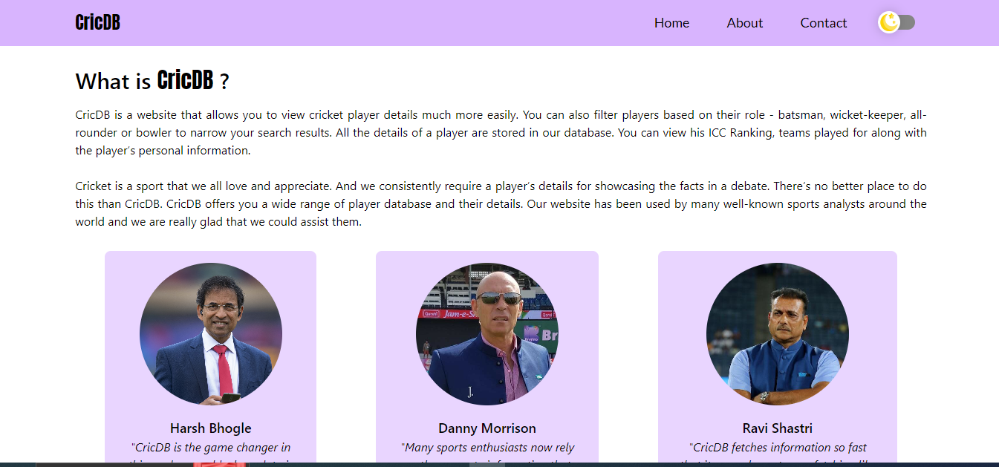
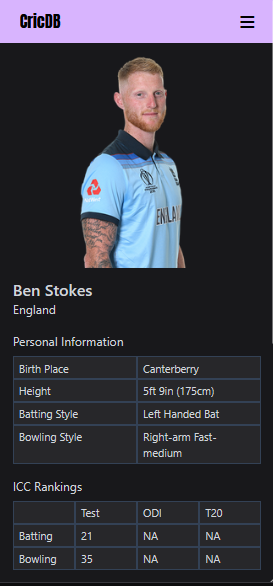

# cric-db
CricDB is a website that allows you to view cricket player details much more easily. You can also filter players based on their role to narrow your search results. All the details of a player are stored in our database.

---

## Tech Stack
- React
- Tailwind CSS
- Node.js
- Express.js
- MongoDB
- Firebase

---

## Preview

### Landing Page

### Player Dashboard in Light Mode

### Filter players category wise | Dashboard in Dark Mode

### Feature to directly search for a player

### Detailed Player Info

### About Page

### Complete Responsiveness

